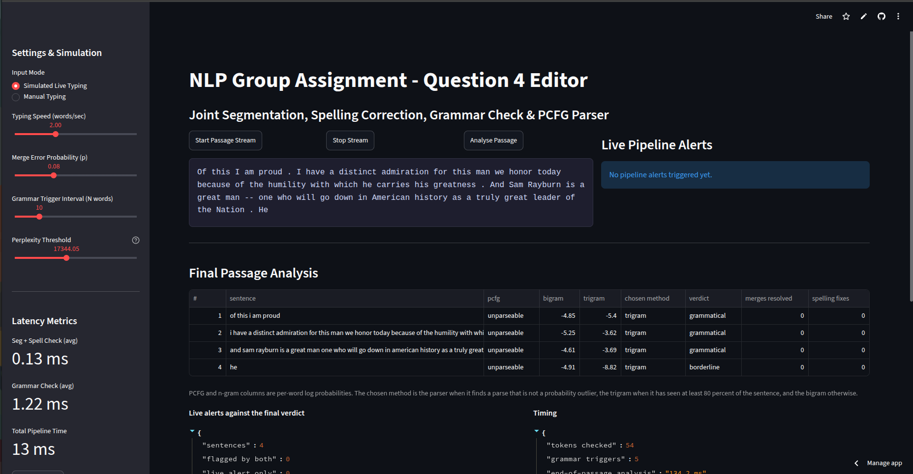
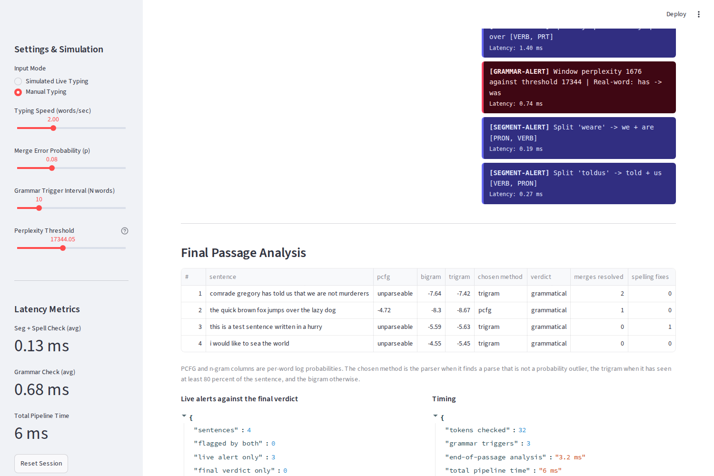

# Question 4 - Report

The live editor from Question 4 runs three sub-systems over one stream of text: the
segmentation and POS decoder trained in Question 1, the spelling corrector built in
Question 3, and the PCFG parser and n-gram grammar models added here. This report covers
the shared language models, the end-of-passage analysis, the deployment and the
benchmark, and it answers the comparison questions in the brief.

Every number below comes from a script in `scripts/`, and the raw output is kept in
`reports/`. Nothing here was typed in by hand.

| What | Command | Output |
| --- | --- | --- |
| Add-k sweep | `venv/bin/python scripts/tune_lm_k.py` | table in section 1.3 |
| PCFG floors | `venv/bin/python scripts/calibrate_pcfg.py` | `models/q4_pcfg_floors.json` |
| Sample runs | `venv/bin/python scripts/run_passage_demo.py --seed 1` | `reports/sample_run_seed1.txt`, `sample_run_seed5.txt`, `sample_run_seed7.txt` |
| Experiments | `venv/bin/python scripts/run_experiments.py` | `reports/experiments.txt` |
| Speed Demon | `venv/bin/python scripts/run_speed_demon.py` | `reports/speed_demon.txt` |
| Live app | `venv/bin/streamlit run app.py` | `reports/live_app.png`, `reports/live_app_analysis.png` |

## Which model comes from where

Nothing from Question 1 or Question 3 is retrained while Q4 runs. `q4/model_loader.py`
loads all of it once and hands the same objects to every sub-system.

| Model | Trained in | Used for |
| --- | --- | --- |
| Witten-Bell trigram LM | Q1, Brown train split of 45,459 sentences | scoring segmentation splits in the beam decoder |
| Trigram HMM tagger, 41,974 known word forms | Q1, same split | POS tags for the split words and for the parser |
| Vocabulary of 40,234 words, unigram and bigram counts, SymDel index | Q3, Brown | non-word and real-word spelling correction |
| Add-k bigram, 23,780 word vocabulary | Q4, Brown train split | sentence scoring in the end-of-passage table |
| Add-k trigram, same vocabulary | Q4, Brown train split | live window perplexity and sentence scoring |
| Pruned Penn Treebank PCFG, 10,603 productions | Q4, treebank sample | constituency parses |

The beam decoder runs with the settings Q1 selected and persisted alongside its models, so
Q4 does not re-choose them: maximum word length 19, beam width 8, alpha and beta both 1.0.

The two Q4 n-gram models are the only ones trained here. They are cached in
`models/q4_grammar_lms.pkl`, which is rebuilt on first run in about 13 seconds and left
out of git because it is 31 MB.

## 1. Parameter choices

### 1.1 Merge probability p = 0.08

The value comes from Part 1 and it is kept. At p = 0.08 a passage of 100 words gets
about eight dropped spaces, which is frequent enough that most sentences contain one
without the passage turning into a stress test. The sweep in `reports/experiments.txt`
shows what p buys:

| p | segment alerts over 20 passages | alerts per 100 words |
| --- | --- | --- |
| 0.00 | 30 | 1.27 |
| 0.04 | 115 | 4.87 |
| 0.08 | 177 | 7.50 |
| 0.16 | 304 | 12.89 |

The p = 0 row is the useful one. No token was merged in that run, so all 30 alerts are
false, which puts the segmentation false-alert rate at 1.3 per 100 words. They are almost
all long words Q1 never saw, such as `fastidiousness` splitting into `fastidious` and
`ness`. Raising p does not move that floor, it only adds real merges on top of it, so the
share of alerts that are wrong falls as p rises.

### 1.2 Trigger interval N = 10

The grammar check reads the last N words every N words. Running it on clean Brown dev
text gives a direct false-alert rate, since real published text should not be flagged at
all:

| N | windows | fired | perplexity only | real-word only | false-alert rate |
| --- | --- | --- | --- | --- | --- |
| 5 | 400 | 64 | 52 | 11 | 16% |
| 10 | 400 | 48 | 31 | 17 | 12% |
| 20 | 400 | 80 | 6 | 73 | 20% |

The two causes pull in opposite directions. Short windows are dominated by perplexity
spikes, because five words are not enough context for the trigram and one rare word
drags the whole window over the threshold. Long windows are dominated by the real-word
check, because every extra word is another chance for some candidate to beat it on a
bigram score. N = 10 sits at the minimum of the two effects. It also bounds how late an
error is caught: a problem is seen at worst ten words after it is typed, which at two
words per second is five seconds.

### 1.3 Add-k constant

Both grammar models are fitted on the Brown train split and scored on the dev split:

| k | bigram dev perplexity | trigram dev perplexity |
| --- | --- | --- |
| 0.001 | 788.6 | **1788.9** |
| 0.01 | **763.8** | 2048.2 |
| 0.1 | 1172.5 | 3651.8 |
| 0.5 | 2049.3 | 6215.0 |
| 1.0 | 2738.4 | 7796.5 |

The two orders want different constants, so they each get their own: k = 0.01 for the
bigram and k = 0.001 for the trigram. The reason is sparsity. Add-k spreads k units of
count over every word in the vocabulary for every context, and a trigram has far more
contexts with tiny counts than a bigram does, so the same k drains much more mass away
from the events that were actually observed. A single shared k = 0.01 would cost the
trigram 14 percent in perplexity for no gain.

Both models are checked for normalisation at training time with `check_normalised`,
because the decision rule compares scores across sentence lengths and a model that leaks
probability mass would bias that comparison.

### 1.4 Perplexity threshold

Part 1 used a fixed threshold of 300, which was tuned against Q1's Witten-Bell model. The
add-k trigram lives on a completely different scale, and a fixed 300 would fire on almost
every window. The threshold is now measured instead. `q4/ngram_lm.py` scores 3,866
ten-word windows from held-out Brown text and takes the 95th percentile, which is 17,344.
That puts roughly 5 percent of clean in-domain windows over the line by design. Measured
again on a different slice of dev text in section 1.2 it comes out at 8 percent for
perplexity alone, and 12 percent once the real-word check is counted as well.

## 2. Tagset reconciliation

Q1 tags with the 12 tag universal set and the PCFG is built over Penn Treebank tags, so
`q4/tagset.py` maps each universal tag to the Penn tag it corresponds to most often, for
example `NOUN` to `NN` and `VERB` to `VBD`. The map is many to one, which is where the
loss comes from: `NN`, `NNS`, `NNP` and `NNPS` all arrive as `NN`.

Measured over 200 treebank sentences:

| Measure | Value |
| --- | --- |
| Mapped tag equals the treebank tag | 58.2% |
| Parse rate using the mapped tags | 39.0% |
| Parse rate using the treebank's own tags | 42.5% |

So the mapping loses about 42 percent of tag identity but only 3.5 points of parse rate.
That gap is explained by how the parser uses tags. A word the grammar has seen is parsed
through its own lexical productions and the predicted tag is ignored, so the tag only
matters for words the grammar does not know. Retagging Q1 at training time would have
removed even that cost, but it would mean retraining Q1's tagger, which the brief rules
out.

## 3. Method selection rule

Each finished sentence is scored three ways and one score is chosen:

1. Use the PCFG when the sentence parses, is at most 25 words, and its per-word parse log
   probability is at least the 2nd percentile of parses of real treebank sentences
   (-9.11). A parse below that is treated as an outlier and not trusted.
2. Otherwise use the trigram, if at least 80 percent of the sentence is in its vocabulary.
3. Otherwise use the bigram.

The verdict comes from the chosen score against floors measured the same way, on 2,000
held-out Brown sentences for the n-grams and 400 treebank sentences for the parser:

| Model | 10th percentile, borderline below | 2nd percentile, ungrammatical below |
| --- | --- | --- |
| PCFG per word | -7.81 | -9.11 |
| Bigram per word | -7.87 | -8.81 |
| Trigram per word | -8.70 | -9.55 |

Two design points are worth stating. Scores are length-normalised, otherwise every long
sentence would look ungrammatical next to a short one. And the 25 word cap on parsing is
not arbitrary: CKY cost grows with the cube of the length, and treebank sentences beyond
that length are rare enough that the pruned grammar has little to say about them.

The rule fires as intended. Over 128 sentences from 20 passages the parser was chosen 21
times, the trigram 101 times and the bigram 6 times.

## 4. Speed Demon benchmark

A batch of exactly 1,000 corrupted words is built with Question 3's generator, then run
through the per-token layer and through the grammar trigger separately. Model loading,
the SymDel index and the batch itself are all prepared before timing starts.

| Layer | Corrupted batch | Ordinary words |
| --- | --- | --- |
| Segmentation and spelling, per word | 0.807 ms | 0.386 ms |
| Grammar trigger, per window of 10 | 0.022 ms | 0.262 ms |
| Grammar trigger, per word | 0.002 ms | 0.026 ms |

On the corrupted batch the per-token layer costs 0.805 ms per word more than the grammar
layer. The ratio of 369 looks dramatic but it is measuring a worst case at both ends.
Every word in that batch is out of vocabulary, which is the most expensive case for
segmentation because the beam decoder has to run, and the cheapest case for the grammar
check because the real-word pass skips unknown words without generating a single
candidate. The control batch of ordinary vocabulary words is the fairer picture: the
per-token layer drops to 0.386 ms because known short words skip the decoder entirely,
and the grammar check climbs to 0.262 ms per window because it now has real words to
generate candidates for.

The conclusion is that no throttling is needed. Even at the worst case of 0.807 ms per
word, a typist at 120 words per minute leaves 500 ms between words, so the check uses
about 0.16 percent of the available time. The measured live figures agree: 0.15 ms mean
per token over 20 passages, with a 95th percentile of 1.12 ms and a worst single token of
11.5 ms, which is one very long merged token that the beam decoder had to work through.
Throttling the segmentation check to the grammar trigger would only delay the split of a
merged token by up to ten words and would save nothing that matters.

## 5. Comparative analysis

### 5.1 Live alerts against the final verdict

Over 128 sentences from 20 passages:

| Case | Sentences |
| --- | --- |
| Flagged live and at the end | 18 |
| Flagged live only | 78 |
| Flagged at the end only | 3 |
| Clean for both | 29 |
| Agreement | 37% |

The 78 sentences flagged live only are not a failure. A segmentation or spelling alert is
a repair, so a sentence that had `thedormitoryand` split correctly is flagged live and
then scores as ordinary English at the end, because by then it is ordinary English. The
live layer reports what it fixed and the final layer reports what the text looks like
after the fixes, so they should disagree on exactly those sentences. Run 1 in
`reports/sample_run_seed1.txt` is the clearest case: 13 segmentation alerts and 5 grammar
alerts, and all six sentences come out grammatical, because all 19 merges were resolved
correctly.

The three sentences flagged only at the end are the ones the live layer had no chance of
catching, and all three turn out to be the same problem. They are the one-word fragments
`cu`, `ft` and `ham`, left behind when the sentence splitter cut on an abbreviation. Each
one is a legal token that no check complains about while it is typed, and each one scores
around -10 per word at the end because a one word sentence of a rare token has nothing to
average against. The verdict is right that something is wrong and wrong about what it is.

That is the general weakness of using a language model score as a grammaticality verdict:
it measures familiarity, not well-formedness. Sentence 5 of run 2, "pedro spent a whole
winter very unhappily", is a perfectly good sentence that scores -9.90 per word and is
called ungrammatical, because `pedro` and `unhappily` are close to absent from Brown.

### 5.2 PCFG against the n-gram models

The two kinds of score catch different things and it shows in the numbers. Only 16.4
percent of the live sentences parsed, against 38.5 percent of treebank sentences of
comparable length. Passage sentences are longer, come from Gutenberg and Brown rather
than the Wall Street Journal, and carry words the pruned grammar never saw.

Where the parser does fire it is the only score that reacts to structure. "the quick
brown fox jumps over the lazy dog" parses at -4.72 per word and is chosen over both
n-gram scores, which rate the same sentence at -8.30 and -8.67 because the individual
word pairs are uncommon in Brown. That is the split in a nutshell: the parser is asking
whether the words form a sentence, and the n-grams are asking whether these particular
words tend to follow one another.

The n-grams catch the local damage the parser cannot see. Every real-word suggestion in
both sample runs came from the bigram check, and every one of them is a local word pair
decision: `so -> do`, `hans -> has`, `falls -> calls`, `met -> let`. The parser has no
opinion on any of those, because the substitutions are all the same part of speech and
leave the tree intact.

The two n-gram models also disagree by domain, which is worth reporting. On the Brown
passage in run 1 the trigram beats the bigram on every sentence, around -3.6 per word
against -5.4. On the Gutenberg passage in run 2 the ordering flips and the bigram is
better on five of six sentences. Add-k gives no real backoff, so out of domain the
trigram's sparse contexts hurt it more than they help. This is why the decision rule
checks trigram coverage before trusting it.

### 5.3 Trigger interval and merge probability against false alerts

Section 1.1 and 1.2 give the measurements. In short, p controls how much genuine work the
segmentation layer has, and it does not affect the false-alert floor of 1.3 alerts per 100
words, which is set by out-of-vocabulary words rather than by merging. N controls the
grammar false-alert rate, which is 12 percent at N = 10 and rises in both directions, and
it also bounds how late an error can be caught. Since the check costs 0.5 ms, the choice
of N is driven entirely by false alerts and not at all by cost.

### 5.4 Interactions between the sub-systems

The sub-systems feed each other, and the errors compound in both directions.

A wrong split creates work for the speller, and the speller then makes it worse. Run 3 in
`reports/sample_run_seed7.txt` has two clean examples. `fastidiousness` is not in Q1's
vocabulary, so the decoder split it into `fastidious` and `ness`, and `ness` is not a word
either, so the spelling check turned it into `less`. `lamented` went the same way into
`la` and `mented`, the speller made `mented` into `melted`, and the next grammar trigger
then suggested `la -> a` on top of that. One segmentation mistake travelled through all
three sub-systems and came out as three wrong words. The order of the checks makes this
unavoidable, since the spelling check is defined to run on whatever the segmentation check
leaves behind.

Out-of-vocabulary proper nouns are the same story. Run 3 split `Musgrove` into `mus` and
`grove` and then corrected `mus` to `must`, and run 2 turned the name `piedro` into
`pedro` twice. A corrector whose only notion of correctness is corpus frequency has
nothing sensible to say about a name.

A split can also change which method the decision rule picks. In the seed 9 passage the
single word `Highlander` was split into `high` and `lander`, and `lander` is not in the
trigram vocabulary. Coverage for that sentence dropped to 78 percent, below the 80 percent
threshold, so "murder is a sin said the immovable high lander" was scored by the bigram at
-6.34 rather than by the trigram at -8.20. A segmentation decision about one word decided
which language model judged the sentence.

Whether a repair flips the parse itself is a fair question and the answer is mostly no.
Parsing each repaired sentence and its untouched original, over the 60 sentences of the
sweep that carried a repair and stayed inside the 25 word cap in both versions, 53 parsed
or failed identically, 4 parsed only after the repair and 3 only before it. The fox
sentence from the screenshot is typical: typed as `jumpsover` it already parses at -4.97
per word and the split only improves it to -4.72. The parser's unknown word rule is why.
An unseen token falls back to its predicted POS tag, so a merged token enters the chart as
an ordinary noun and the tree closes over it regardless.

The seven sentences that do flip go both ways in almost equal numbers, which says the
effect is noise rather than improvement. In the seed 9 passage `asperity` was wrongly split
into `as` and `purity`, and "said macian with a sudden as purity" parses while the correct
sentence does not. Two sentences in the seed 14 passage went the other way and stopped
parsing once their merges were resolved. Adding a word changes the span structure, and
with a grammar this sparse that is close to a coin toss.

## 6. Sample runs

### Run 1, Brown passage, seed 1

Full transcript in `reports/sample_run_seed1.txt`. 144 tokens, 13 segmentation alerts, 0
spelling alerts, 5 grammar alerts.

| # | sentence | pcfg | bigram | trigram | chosen | verdict | merges | fixes |
| --- | --- | --- | --- | --- | --- | --- | --- | --- |
| 1 | the brothers continued to help each other ... | unparseable | -5.42 | -3.69 | trigram | grammatical | 4 | 0 |
| 2 | they supplemented their income by small gov... | unparseable | -6.05 | -3.59 | trigram | grammatical | 1 | 0 |
| 3 | so impressive were those serious years of s... | unparseable | -5.43 | -3.73 | trigram | grammatical | 3 | 0 |
| 4 | there is a struggle there in which if he fa... | unparseable | -5.34 | -3.54 | trigram | grammatical | 3 | 0 |
| 5 | i lived in this on ward driving contest whe... | unparseable | -6.45 | -5.09 | trigram | grammatical | 6 | 0 |
| 6 | he openly proclaimed his pleasure in lectur... | unparseable | -6.31 | -3.59 | trigram | grammatical | 2 | 0 |

Thirteen segmentation alerts recovered nineteen word boundaries and twelve of the thirteen
splits were right. The exception is in sentence 5, where `onward-drivingcontestwhere`
became `on ward driving contest where`, and the trigram score of -5.09 is visibly worse
than the other five sentences as a result. All five grammar alerts in this run were
real-word suggestions and all five were wrong, which is the cost of the 2.0 nat margin
inherited from Q3.

### Run 2, Gutenberg passage, seed 5

Full transcript in `reports/sample_run_seed5.txt`. 144 tokens, 11 segmentation alerts, 4
spelling alerts, 5 grammar alerts.

| # | sentence | pcfg | bigram | trigram | chosen | verdict | merges | fixes |
| --- | --- | --- | --- | --- | --- | --- | --- | --- |
| 1 | pedro was taunted and treated with contempt... | unparseable | -6.85 | -7.04 | trigram | grammatical | 1 | 1 |
| 2 | his father when he found that his son s sma... | unparseable | -5.70 | -7.56 | trigram | grammatical | 2 | 0 |
| 3 | all the food or clothes that he had at home... | unparseable | -6.14 | -6.46 | trigram | grammatical | 5 | 0 |
| 4 | you must eat this now instead of gourd and ... | unparseable | -8.02 | -8.76 | trigram | borderline | 1 | 2 |
| 5 | pedro spent a whole winter very unhappily | unparseable | -9.03 | -9.90 | trigram | ungrammatical | 1 | 1 |
| 6 | he expected that all his old tricks and esp... | unparseable | -6.50 | -8.25 | trigram | grammatical | 1 | 0 |

The contrast with run 1 is the point. Same settings and the same token count, but the text
is out of domain, the bigram beats the trigram on five of six sentences, and the two
sentences that carry spelling corrections of proper nouns and rare words are the two that
fail the verdict. This run also has the only perplexity-driven alert of the three: the
final trigger fired at 32,426 against the threshold of 17,344, with no real-word
suggestion attached to it.

### Run 3, Gutenberg passage, seed 7

Full transcript in `reports/sample_run_seed7.txt`. This is the longest of the three at 364
tokens, and it is where the interaction examples in section 5.4 come from. All six
sentences were judged grammatical and 29 merges were resolved, but three of the
segmentation splits were wrong in a way that cascaded: `fastidiousness`, `lamented` and
`Musgrove` are all real words that the decoder broke apart because Q1 had never seen
them.

## 7. Live deployment

The Streamlit app is in `app.py` and runs with `venv/bin/streamlit run app.py`. It has
two modes. Simulated live typing streams a sampled passage token by token with a
configurable delay, and manual typing processes each new word as it is entered rather than
waiting for the whole passage. Both modes share `q4/pipeline.py` with the scripts, so the
alerts in the browser are produced by the same code as the transcripts above.

The first screenshot is the manual typing mode part way through a passage. All three
alert types are visible with their latencies, and the sidebar reports the running
averages.

The second screenshot is the same session after the analysis. Sentence 2 is the fox
sentence, which parses at -4.72 per word and is the one row where the parser is chosen.
The merges resolved and spelling fixes columns show two merges in sentence 1, one in
sentence 2 and one spelling fix in sentence 3. The whole session cost 6 ms of pipeline
time across 32 tokens, 3 grammar triggers and a 3.2 ms final analysis.

## 8. Limitations

- The pruned grammar is the main limit on the parser. Keeping every production instead of
  only those seen twice raises the parse rate from 41 percent to 65 percent on a sample of
  150 treebank sentences, but the grammar pickle grows to 116 MB, which is over GitHub's
  file limit, and parsing slows from 34 ms to 1,048 ms per sentence. At a second per
  sentence the end-of-passage analysis would stop being interactive, so the pruned grammar
  stays and the decision rule is built to cope with unparseable sentences instead.
- Very short fragments score well and are called grammatical. A one word sentence such as
  `mccormack` has almost nothing to average over, so its per-word score is dominated by
  the sentence-end probability and lands above the floor.
- The first parse in a process pays about 200 ms to build the grammar's rule index, and a
  cold end-of-passage analysis comes in around 700 ms as a result. Every analysis after
  that in the same session runs in 15 to 50 ms.
- Add-k is a weak smoother. It is what the brief asks for, and the perplexities in
  section 1.3 show what it costs compared to the Witten-Bell model Q1 uses for the same
  corpus.
- The real-word check produces most of the grammar alerts and most of them are wrong. The
  2.0 nat margin comes from Q3 and was tuned for sentence-level correction, not for
  ten-word windows that can cut across a sentence boundary.
- Sentences are cut on final punctuation, with a guard for single letter initials. An
  abbreviation such as `U.S.` still splits a sentence in two.
